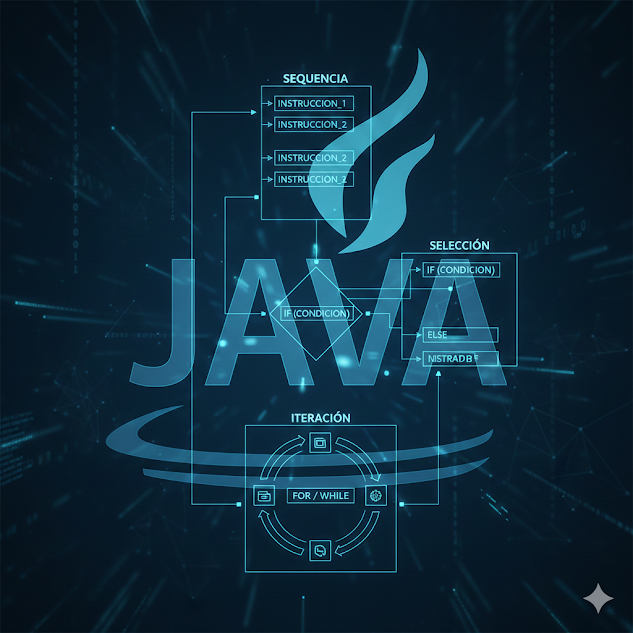

# Programación Estructurada en Java

Este repositorio está dedicado a explorar y comprender los principios fundamentales de la programación estructurada utilizando el lenguaje Java. Aquí encontrarás ejemplos, ejercicios y recursos que te ayudarán a dominar este paradigma de programación esencial.

## ¿Qué es la Programación Estructurada?

La programación estructurada es un paradigma de programación que busca mejorar la claridad, calidad y tiempo de desarrollo de un programa de computadora utilizando un conjunto de estructuras de control de flujo bien definidas:
* **Secuencia:** Las instrucciones se ejecutan en el orden en que aparecen.
* **Selección (o Decisión):** Permite ejecutar diferentes bloques de código basados en una condición (e.g., `if-else`, `switch`).
* **Iteración (o Repetición):** Permite ejecutar un bloque de código varias veces (e.g., `for`, `while`, `do-while`).

Este enfoque promueve un diseño de programa más organizado, fácil de entender y de mantener, reduciendo la complejidad y la probabilidad de errores.

## Contenido del Repositorio

El repositorio está organizado de la siguiente manera:

* **`src/`**: Contiene el código fuente de los ejemplos y ejercicios en Java.
    * `ejemplos/`: Pequeños programas que ilustran conceptos específicos de la programación estructurada.
        * `secuencia/`: Demostraciones de ejecución secuencial.
        * `seleccion/`: Ejemplos de sentencias `if`, `else if`, `switch`.
        * `iteracion/`: Uso de bucles `for`, `while`, `do-while`.
    * `ejercicios/`: Problemas propuestos para practicar y aplicar los conocimientos.
* **`docs/`**: Documentación adicional, explicaciones de conceptos y guías.
* **`README.md`**: Este archivo.

